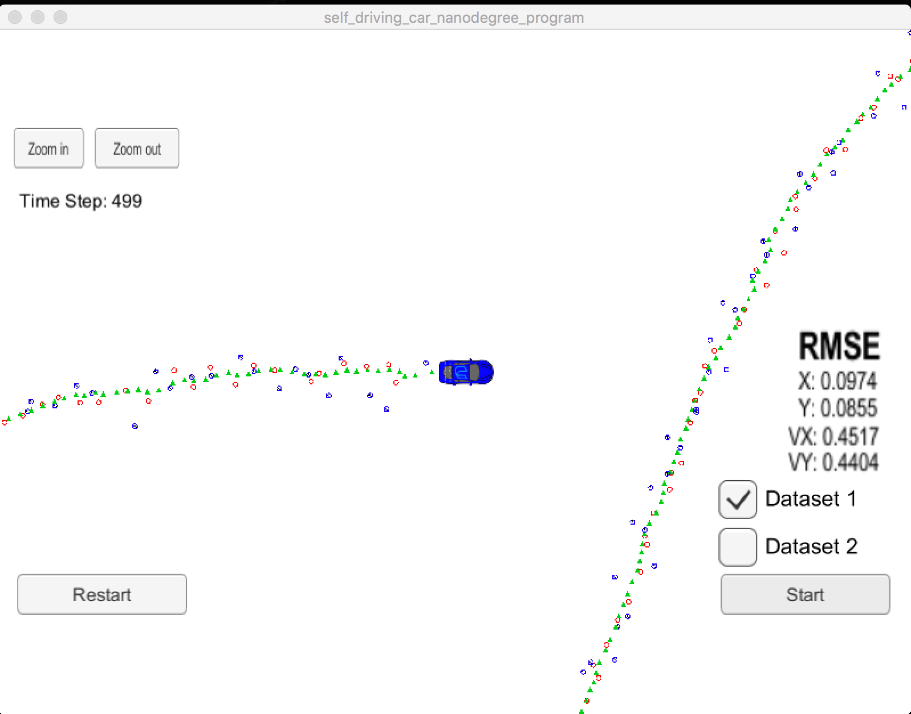
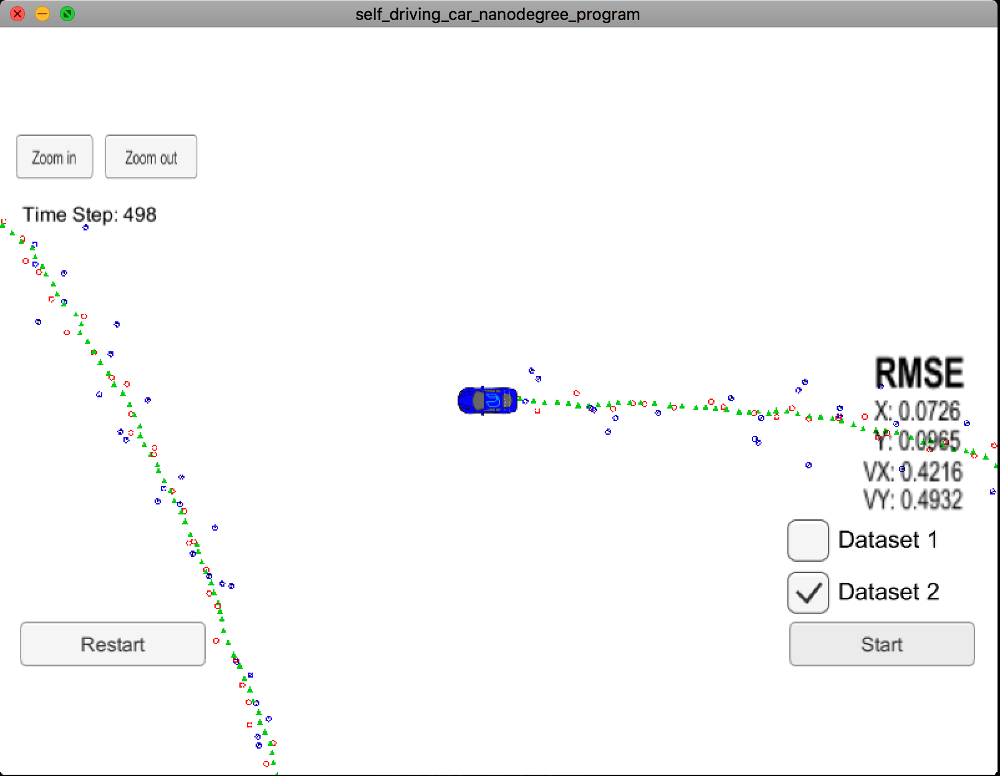

# Extended Kalman Filter Project Starter Code

This project involves the Term 2 Simulator which can be downloaded [here](https://github.com/udacity/self-driving-car-sim/releases)

This repository includes two files that can be used to set up and install [uWebSocketIO](https://github.com/uWebSockets/uWebSockets) for either Linux or Mac systems. For windows you can use either Docker, VMware, or even [Windows 10 Bash on Ubuntu](https://www.howtogeek.com/249966/how-to-install-and-use-the-linux-bash-shell-on-windows-10/) to install uWebSocketIO. Please see [this concept in the classroom](https://classroom.udacity.com/nanodegrees/nd013/parts/40f38239-66b6-46ec-ae68-03afd8a601c8/modules/0949fca6-b379-42af-a919-ee50aa304e6a/lessons/f758c44c-5e40-4e01-93b5-1a82aa4e044f/concepts/16cf4a78-4fc7-49e1-8621-3450ca938b77) for the required version and installation scripts.

Once the install for uWebSocketIO is complete, the main program can be built and run by doing the following from the project top directory.

1. mkdir build
2. cd build
3. cmake ..
4. make
5. ./ExtendedKF

---

## Other Important Dependencies

* cmake >= 3.5
  * All OSes: [click here for installation instructions](https://cmake.org/install/)
* make >= 4.1 (Linux, Mac), 3.81 (Windows)
  * Linux: make is installed by default on most Linux distros
  * Mac: [install Xcode command line tools to get make](https://developer.apple.com/xcode/features/)
  * Windows: [Click here for installation instructions](http://gnuwin32.sourceforge.net/packages/make.htm)
* gcc/g++ >= 5.4
  * Linux: gcc / g++ is installed by default on most Linux distros
  * Mac: same deal as make - [install Xcode command line tools](https://developer.apple.com/xcode/features/)
  * Windows: recommend using [MinGW](http://www.mingw.org/)

## Basic Build Instructions

1. Clone this repo.
2. Make a build directory: `mkdir build && cd build`
3. Compile: `cmake .. && make` 
   * On windows, you may need to run: `cmake .. -G "Unix Makefiles" && make`
4. Run it: `./ExtendedKF `

# [Rubric](https://review.udacity.com/#!/rubrics/748/view)

## Your code should compile

Code must compile without errors with cmake and make, I did not change `CMakeLists.txt` and the code compiles as expected, after installing the requirements.

```
-- The C compiler identification is AppleClang 9.0.0.9000039
-- The CXX compiler identification is AppleClang 9.0.0.9000039
-- Check for working C compiler: /Applications/Xcode.app/Contents/Developer/Toolchains/XcodeDefault.xctoolchain/usr/bin/cc
-- Check for working C compiler: /Applications/Xcode.app/Contents/Developer/Toolchains/XcodeDefault.xctoolchain/usr/bin/cc -- works
-- Detecting C compiler ABI info
-- Detecting C compiler ABI info - done
-- Detecting C compile features
-- Detecting C compile features - done
-- Check for working CXX compiler: /Applications/Xcode.app/Contents/Developer/Toolchains/XcodeDefault.xctoolchain/usr/bin/c++
-- Check for working CXX compiler: /Applications/Xcode.app/Contents/Developer/Toolchains/XcodeDefault.xctoolchain/usr/bin/c++ -- works
-- Detecting CXX compiler ABI info
-- Detecting CXX compiler ABI info - done
-- Detecting CXX compile features
-- Detecting CXX compile features - done
-- Configuring done
-- Generating done
-- Build files have been written to: /Users/feleir/Desktop/SelfDriving/Forks/CarND-Extended-Kalman-Filter-Project/build
Scanning dependencies of target ExtendedKF
[ 20%] Building CXX object CMakeFiles/ExtendedKF.dir/src/main.cpp.o
[ 40%] Building CXX object CMakeFiles/ExtendedKF.dir/src/tools.cpp.o
[ 60%] Building CXX object CMakeFiles/ExtendedKF.dir/src/FusionEKF.cpp.o
[ 80%] Building CXX object CMakeFiles/ExtendedKF.dir/src/kalman_filter.cpp.o
[100%] Linking CXX executable ExtendedKF
ld: warning: directory not found for option '-L/usr/local/Cellar/libuv/1*/lib'
[100%] Built target ExtendedKF
```

## Accuracy

### px, py, vx, vy output coordinates must have an RMSE <= [.11, .11, 0.52, 0.52] when using the file: "obj_pose-laser-radar-synthetic-input.txt which is the same data file the simulator uses for Dataset 1"

For the dataset 1 the obtained accuracy is.

RMSE = [0.0974, 0.0855, 0.4517, 0.4404] <= [.11, .11, 0.52, 0.52]


For the dataset 2 the obtained accuracy is.

RMSE = [0.0726, 0.0965, 0.4216, 0.4932] <= [.11, .11, 0.52, 0.52]


## Follows the correct algorithm

### Your Sensor Fusion algorithm follows the general processing flow as taught in the preceding lessons.

Kalman filter implementation described in the lessons can be found in [src/kalman_filter.cpp](./src/kalman_filter.cpp), and the Extended Kalman Filter algorithm that calls predict and then update can be found in [src/FusionEKF.cpp](./src/FusionEKF.cpp].

### Your Kalman Filter algorithm handles the first measurements appropriately.

First measurement is handled in [src/FusionEKF.cpp](./src/FusionEKF.cpp#L57-L90) initializing the state, taking into account radar or lidar measurements.

### Your Kalman Filter algorithm first predicts then updates.

Algorithm first updates the state transition matrix and the process noise covariance matrix, then calls kalman filter predict in [src/FusionEKF.cpp](./src/FusionEKF.cpp#122). In the last step calls update depending on radar [src/FusionEKF.cpp](./src/FusionEKF.cpp#134) or lidar [src/FusionEKF.cpp](./src/FusionEKF.cpp#140) data.

### Your Kalman Filter can handle radar and lidar measurements.

As described before EKP code will call different methods for Kalman filter update depending on the type on sensor data.

- Radar, [UpdateEKF](./src/kalman_filter.cpp#L35)
- Lidar, [Update](./src/kalman_filter.cpp#L29)

## Code Efficiency

### Your algorithm should avoid unnecessary calculations.

Data stored to avoid running the same calculation repeatedly, like for example in [src/FusionEKF.cpp](./src/FusionEKF.cpp#109).